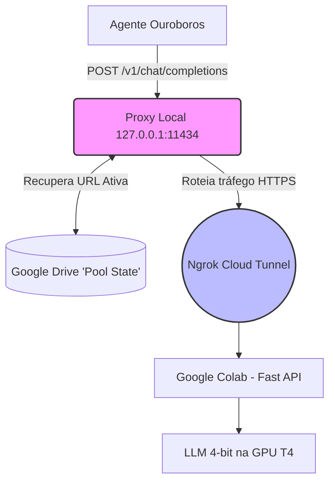

# Colab Infinity

> **Poder computacional gratuito, resiliente e contínuo para agentes autônomos.**
> Transforma o Google Colab gratuito em um servidor de LLM escalável, com rotação automática de contas suportada por **Ngrok**, persistência via Google Drive e compatibilidade Drop-In estrita com a API OpenAI.

---

[](https://opensource.org/licenses/MIT)
[](https://www.python.org/downloads/)
[](https://platform.openai.com/docs/api-reference)
[]()

---

## O que é o Colab Infinity?

O **Colab Infinity** é uma infraestrutura de inferência avançada (MLOps) desenhada puramente para alimentar ambientes de desenvolvimento contínuo focados em múltiplos Agentes Autônomos — tais como o [Ouroboros Runtime](https://github.com/RenyEnnos/ouroboros-runtime), OpenClaw, entre outros.

Enquanto a execução contínua de tarefas através de LLMs em APIs pagas pode drenar recursos vertiginosamente, o Colab Infinity constrói um Orquestrador Local em Python (com Playwright) que gerencia um "Pool" de múltiplas contas do Google gratuitas. Através de monitoramento contínuo e injeção de conexões proxy, assim que uma máquina do Colab entra em falência de limites de tempo ou GPU (ex: a famosa T4 16GB), o Orquestrador injeta cookies em uma conta adjacente, refaz o *tunneling* via **Ngrok** e repassa o estado via Google Drive.

O Cliente nunca percebe a queda, operando sobre uma *Base URL* local indestrutível.



### Principais Diferenciais Arquiteturais

- **Drop-in OpenAI API** — Seu projeto TypeScript/Python nativo via Langchain nem sequer desconfia que o *Endpoint* não pertence à empresa OpenAI.
- **Failover Automatizado** — Troca transparente e "sem-toque" quando uma cota Google expira (MTTR < 8 minutos mantendo fila no proxy).
- **Sem Port-Forwarding Obscuro** — Uso da robusta rede pública do Ngrok, abstraindo complexidades de NAT e roteamento reverso no desenvolvimento doméstico.
- **Custos Aniquilados** — Google Colab Free + Ngrok Free + Google Drive Free. Custos computacionais igual a zero.

---

## Estrutura da Documentação (State of the Art)

Toda a engenharia e arquitetura do projeto foram rigorosamente consolidadas e estão localizadas na pasta `docs/`.

| ID | Documento | Descrição |
|:---:|---|---|
| `01` | [Project Charter](docs/01_project_charter.md) | Visão, Escopo e Objetivos de negócio da plataforma. |
| `02` | [Especificação de Requisitos (SRS)](docs/02_srs.md) | RFs, RNFs e restrições adotando Ngrok. |
| `03` | [Arquitetura (SAD)](docs/03_architecture.md) | Diagramas em C4, decisões de design e fluxos de rede. |
| `04` | [Especificação de API](docs/04_api_spec.md) | Contratos JSON Drop-in e Tratamento de Erros no Proxy. |
| `05` | [Setup Guide](docs/05_setup_guide.md) | Instalação minuciosa com Playwright e chaves de proteção. |
| `06` | [Runbook / Operação](docs/06_runbook.md) | Monitoramento e recuperação rápida de falhas. |
| `07` | [Plano de Testes](docs/07_test_plan.md) | Testes End-to-End validando transições do Playwright. |
| `08` | [Análise de Risco](docs/08_risk_analysis.md) | Mapeamento de possíveis Shadowbans e bloqueios. |
| `09` | [Guia de Integração](docs/09_integration_guide.md) | Como conectar Langchain/Ouroboros ao Ngrok proxy. |
| `10` | [Deploy Checklist](docs/10_deploy_checklist.md) | Verificação passo-a-passo antes de ignição de longa duração. |

---

## Setup Rápido em 3 Passos

### 1. Clonar e Inicializar (Requer Python 3.10+)

```bash
git clone https://github.com/RenyEnnos/colab-infinity.git
cd colab-infinity
python3 -m venv .venv && source .venv/bin/activate
pip install -r requirements.txt
playwright install
```

### 2. Cadastrar Workers Seguros
Crie e proteja as contas de Pool com permissões unix rígidas.

```bash
mkdir -p ~/.colab_infinity
# Crie e edite seu arquivo localmente
touch ~/.colab_infinity/accounts.json
chmod 600 ~/.colab_infinity/accounts.json
```
*(Confirme a injeção do seu token Ngrok no arquivo json referenciando o `docs/05_setup_guide.md`)*

### 3. Engatar Orquestrador
```bash
python3 -m colab_infinity.orchestrator --config ~/.colab_infinity/colab_infinity_config.yaml
# Agora, é só testar: curl -s http://127.0.0.1:11434/v1/status
```

---

## Aviso Ético e Legal

> ⚠️ **Este projeto usa automação agressiva sobre camadas gratuitas do Google Colab e Ngrok.**
> Sua utilização é puramente de cunho de Engenharia, Desenvolvimento Pessoal e Pesquisa (MLOps em *Shadow IT*).
> Práticas comerciais diretas via APIs subjacentes a esta arquitetura violam Termos de Serviço destas provedoras.
> Não transite dados sensíveis PII, pois a camada Ngrok Free expõe a URL pública do modelo durante a sessão.

## Licença

[MIT License](LICENSE) — Copyright (c) 2025 Colab Infinity Contributors.
